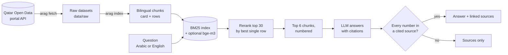

# Arabic RAG Assistant · مساعد الإحصاءات

[](https://github.com/A7mad8asim/arabic-rag-assistant/actions/workflows/tests.yml)

**Ask Qatar's official open statistics a question in Arabic or English, and get a short answer where every figure links to the dataset it came from.**

The corpus is the **1,432 datasets the National Planning Council publishes on the [Qatar Open Data portal](https://www.data.gov.qa)**: population, labour, health, energy, trade, transport and more, about 3.2 million rows in all.

The design rule: **the model may only repeat a number that appears in a source it cites.** If an answer contains any other number, it is not shown, and the reader gets the sources instead. If the sources don't contain the answer, the model must say so.


> Status: **work in progress.** The pipeline, the app, tests, a 120-question gold set with a held-out split, and a reranker ablation are in place. See [Roadmap](#roadmap).

---

## How it works



| Step | What happens | Where |
| --- | --- | --- |
| Fetch | Downloads the catalog and each dataset's rows through the portal's Explore API v2.1, caching them locally. A second run only downloads what changed | `portal.py` |
| Chunk | One *card* per dataset (titles, descriptions, keywords and columns in both languages) plus *row* chunks grouped by year | `chunking.py` |
| Bilingual rows | The portal keeps Arabic values in twin columns (`municipality` = Doha, `lbldy` = الدوحة). Twins are paired by their normalized Arabic label and written together, `Doha / الدوحة`, so one chunk matches a question in either language | `chunking.py` |
| Retrieve | BM25 over normalized, lightly stemmed tokens (Arabic diacritics, hamza and taa marbuta variants, Arabic-Indic digits unified). Optional hybrid with bge-m3 embeddings via Ollama, fused by reciprocal rank fusion | `text.py`, `index.py` |
| Rerank | BM25 scores a chunk as a whole, so a 20-row chunk can win because "Doha", "2023" and "hotel" appear in *different* rows. The reranker scores each of the top 30 chunks by its best *single* row (question words and numbers in that one row), blended with BM25. Optional: an LLM reranker that asks the model which candidates hold the answer | `rerank.py` |
| Answer | A local **Qwen3-8B via Ollama** answers from the numbered sources only, in the question's language, citing `[n]`. Claude via the API is an optional comparison | `llm.py`, `pipeline.py` |
| Check | Every number in the answer must appear in a cited source (or the question). Otherwise the answer is withheld | `pipeline.py` |

## Quick start

Requires Python 3.11+ and [Ollama](https://ollama.com). Commands are for Windows PowerShell; on macOS/Linux activate with `source .venv/bin/activate`.

```powershell
python -m venv .venv
.venv\Scripts\activate
pip install -e ".[dev]"
ollama pull qwen3:8b

arag fetch            # downloads the 1,432 datasets (about 20 minutes the first time)
arag index            # builds the search index
arag ask "How many hotel gyms were there in Doha in 2023?"
arag ask "كم عدد المواليد الأحياء المسجلين في 2020؟"
arag search "electricity consumption residential"   # retrieval only, no answer
```

Run the app (answers with expandable, linked source cards; also shows when an answer was withheld):

```powershell
pip install -e ".[app]"
streamlit run app.py
```

Settings are listed in [`.env.example`](.env.example). `arag fetch --limit 50` downloads a small sample for a quick try.

## Evaluation

```powershell
arag eval --retrieval-only     # retrieval metrics only, no answers
arag eval                      # also answers every question and scores the answers
arag eval --ablation           # every reranker (none, rows, llm) -> eval/results/ablation.md
python eval/build_gold.py      # rebuild the test questions, re-verifying every answer against the data
```

- **Gold set ([`eval/gold.jsonl`](eval/gold.jsonl)): 120 questions.** 50 lookups asked in both English and Arabic (13 of the Arabic ones in Gulf dialect), plus 10 pairs the data cannot answer (out of scope, or years with no data).
  - **Dev split (40):** the original seed set, used to design and tune the system.
  - **Test split (80):** written afterwards and held out. Each test question is generated by [`eval/build_gold.py`](eval/build_gold.py), which refuses to write it unless exactly one row of its dataset matches and holds the expected value.
  - **Equivalent tables:** the portal often publishes the same table twice (`...-gender` and `...-gender0`) or the same figure in two tables. These are listed as accepted alternatives, and each one is verified to hold the answer row.
- **Retrieval, over the 6 chunks the model sees:**
  - *Evidence@k*: did the chunk holding the answer row come back? This is the strict test: the right table with the wrong rows fails it.
  - *Dataset hit@k*: did any chunk of the right table come back?
- **Answers:** a lookup is correct when the answer passes the grounding check, contains the gold value and cites an accepted dataset. An unanswerable question is correct when the system says it could not find the answer.

### Results

**75–78% of held-out questions answered correctly on a local 8B model; 90% of unanswerable questions refused; 11 of 13 Gulf-dialect questions correct. Every figure shown is traceable to a cited dataset.**

Measured on 7 October 2026: Qwen3-8B (4-bit) via Ollama on an RTX 5060 Ti 16 GB, BM25 retrieval, top 6 chunks, index of 23,465 chunks from 1,432 datasets. Raw results: [`eval/results/ablation.md`](eval/results/ablation.md) and `ablation_*.json`.

**Held-out test split (80 questions):**

| Reranker | Evidence@1 | Evidence@6 | Dataset hit@1 | Answer accuracy (EN / AR) | Unanswerable refused | Wrong but shown | Withheld | Time per question |
| --- | --- | --- | --- | --- | --- | --- | --- | --- |
| none (BM25 order) | 57% | 86% | 70% | **78%** (72% / 82%) | 90% | 6 | 6 | 3.6 s |
| **rows** (default) | 67% | 87% | 76% | 75% (78% / 72%) | 90% | 9 | 8 | 3.8 s |
| llm | **73%** | 87% | **80%** | 75% (75% / 75%) | 90% | 8 | 8 | 6.6 s |

**Dev split (40 questions, used for tuning):**

| Reranker | Evidence@1 | Evidence@6 | Dataset hit@1 | Answer accuracy (EN / AR) | Unanswerable refused | Wrong but shown | Withheld |
| --- | --- | --- | --- | --- | --- | --- | --- |
| none | 30% | 77% | 63% | 75% (70% / 80%) | 90% | 3 | 3 |
| rows | 47% | 80% | 67% | 75% (70% / 80%) | 90% | 3 | 4 |
| llm | 80% | 87% | 87% | 82% (80% / 85%) | 90% | 2 | 2 |

What this shows:

- **Reranking fixes retrieval.** The answer row is ranked first in 57% of held-out questions with BM25 alone, 67% with the row reranker and 73% with the LLM reranker. The row reranker's two weights were set on the dev split and barely matter (every setting tried gave the same dev result).
- **…but not the answers yet.** On held-out questions answer accuracy stays at 75–78% whichever reranker is used. The 3-point gap is 2 questions out of 80, within noise. The LLM reranker's dev gain (75% → 82%) did not carry over.
- **The bottleneck has moved to reading.** In the remaining errors the right chunk is often ranked first, but the 8B model picks a neighbouring row of the same 20-row chunk, adds numbers together (the grounding check withholds those), or says it found nothing. The next step is to show the model only the matching rows, and to compare a stronger model on the same set.
- **The grounding check does its job:** 6–8 answers per run contained a number that was not in their cited sources and were withheld instead of shown.
- **Gulf dialect holds up:** 11 of 13 dialect questions answered correctly in every configuration.
- **Default:** `rows`. It costs nothing (about a millisecond), puts the right row in the app's source cards more often, and its answer accuracy is within noise of the others. `RERANK=llm` or `none` switches it.
- **An evaluation lesson:** the first run under-counted correct answers, because several cited an identical row in a duplicate table. Auditing those answers added verified alternatives to the gold set; `eval/build_gold.py` records each one.

## Roadmap

- [x] Grow the gold set to 120 questions (50 pairs + 10 unanswerable pairs) with a held-out test split
- [x] Reranker ablation (none / best-row / LLM)
- [ ] Show the model only the rows that match the question, to fix wrong-row answers
- [ ] Ablation: + bge-m3 hybrid retrieval, + query translation
- [x] Streamlit app with cited sources and a screenshot
- [ ] Handle the 16 datasets with more than 5,000 rows (currently indexed by their description card only)
- [ ] Compare Qwen3-8B with the Claude API on the same set; Docker

## Data and licence

Data: National Planning Council, State of Qatar, via the [Qatar Open Data portal](https://www.data.gov.qa), licensed [CC BY 4.0](https://creativecommons.org/licenses/by/4.0/). The data is downloaded by `arag fetch` and is not stored in this repository. Answers are only as current as the last fetch; always check the linked dataset before relying on a figure.
