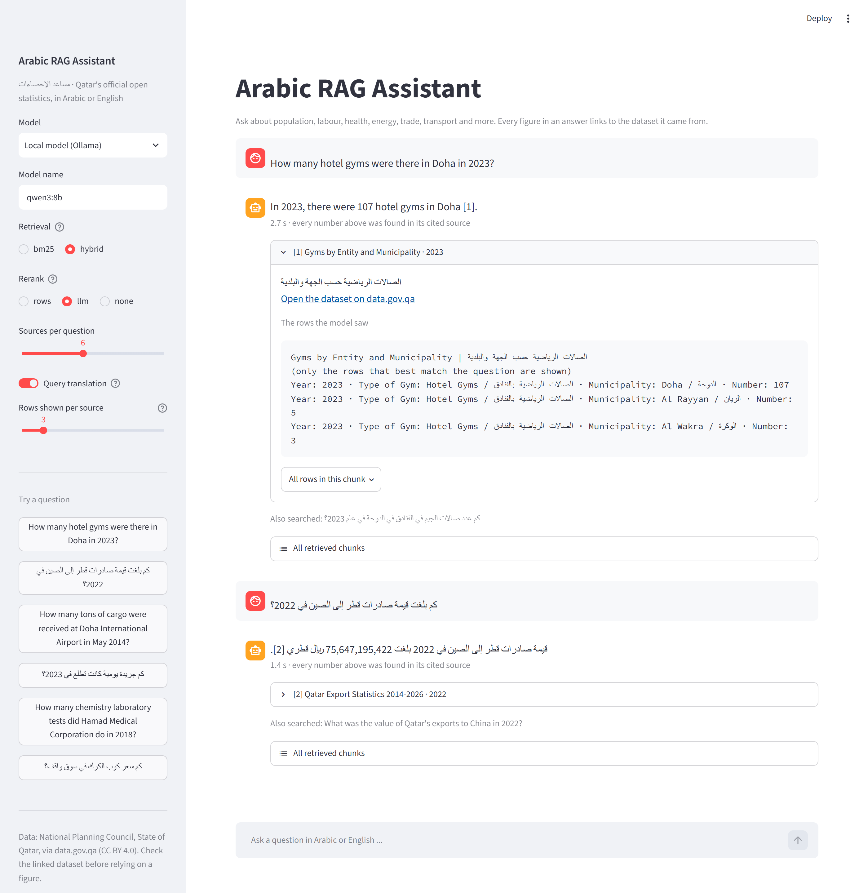
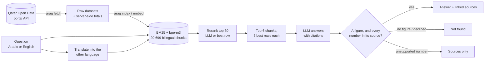

# Arabic RAG Assistant · مساعد الإحصاءات

[](https://github.com/A7mad8asim/arabic-rag-assistant/actions/workflows/tests.yml)

**Ask Qatar's official open statistics a question in Arabic or English, and get a short answer where every figure links to the dataset it came from.**

The corpus is the **1,432 datasets the National Planning Council publishes on the [Qatar Open Data portal](https://www.data.gov.qa)**: population, labour, health, energy, trade, transport and more, about 3.2 million rows in all.

The design rule: **the model may only repeat a number that appears in a source it cites.** If an answer contains any other number, it is not shown, and the reader gets the sources instead. If the sources don't contain the answer, the system says so.

**Result, on a local 8B model at about 2 seconds per question: 82.5% of held-out questions and 87.5% of questions about the large trade and mortality tables answered correctly, and every unanswerable question refused** ([details](#results)).



---

## How it works



| Step | What happens | Where |
| --- | --- | --- |
| Fetch | Downloads the catalog and each dataset's rows through the portal's Explore API v2.1, caching them locally. A second run only downloads what changed | `portal.py` |
| Large tables | Datasets up to 30,000 rows are indexed in full. The six foreign-trade tables (2.8 million rows) are indexed as **server-side totals** by year × country and year × month (the portal computes `sum()` with `group_by`). Only additive measures are summed: value in riyals and weight in kg, never quantities with mixed units. These chunks say they are computed totals | `large.py` |
| Chunk | One *card* per dataset (titles, descriptions, keywords and columns in both languages) plus *row* chunks grouped by year, 20 rows each | `chunking.py` |
| Bilingual rows | The portal keeps Arabic values in twin columns (`municipality` = Doha, `lbldy` = الدوحة). Twins are paired by their normalized Arabic label and written together, `Doha / الدوحة`, so one chunk matches a question in either language | `chunking.py` |
| Translate | The model translates the question into the other language (Arabic ↔ English). Both are searched and the rankings fused. Gulf-dialect words that never appear in the data ("تطلع", "دكتور") get their standard equivalents | `query.py` |
| Retrieve | BM25 over normalized, lightly stemmed tokens (Arabic diacritics, hamza and taa marbuta variants, Arabic-Indic digits unified), fused with **bge-m3** embeddings by reciprocal rank fusion | `text.py`, `index.py` |
| Rerank | BM25 scores a chunk as a whole, so a 20-row chunk can win because "Doha", "2023" and "hotel" appear in *different* rows. The LLM reranker asks the model which of the top 30 candidates hold the answer; the cheaper row reranker scores each chunk by its best *single* row | `rerank.py` |
| Focus | Each table chunk is cut to the **3 rows** that best match the question (and its translation) before the model sees it, so it cannot quote a neighbouring row | `rerank.py` |
| Answer | A local **Qwen3-8B via Ollama** answers from the numbered sources only, in the question's language, citing `[n]`. Claude via the API is an optional comparison | `llm.py`, `pipeline.py` |
| Check | A reply without a new figure, or that declines in words ("the data does not include…", "لا يوجد…"), is reported as **not found**. A figure that is not in its cited source (as the model saw it) is **withheld**, and the sources are shown instead | `pipeline.py` |

## Quick start

Requires Python 3.11+ and [Ollama](https://ollama.com). Commands are for Windows PowerShell; on macOS/Linux activate with `source .venv/bin/activate`.

```powershell
python -m venv .venv
.venv\Scripts\activate
pip install -e ".[dev,app]"
copy .env.example .env    # the recommended setup (hybrid + translation + LLM rerank + 3 rows)
ollama pull qwen3:8b
ollama pull bge-m3

arag fetch            # downloads the 1,432 datasets (about 20 minutes the first time)
arag index            # builds the BM25 index
arag embed            # adds bge-m3 vectors for hybrid retrieval (about 30 minutes on a GPU)
arag ask "How many hotel gyms were there in Doha in 2023?"
arag ask "كم بلغت قيمة صادرات قطر إلى الصين في 2022؟"
streamlit run app.py  # the app: answers, linked source cards, the rows the model saw
```

Without a `.env`, everything runs on the zero-download setup (BM25 + row reranker, no `bge-m3`, no `arag embed`): nearly as good on the general held-out questions (81% vs 82.5%), but far weaker on the large trade tables (50% vs 87.5%) and on Gulf dialect. Every setting is in [`.env.example`](.env.example), and each can be overridden per command (`--retrieval`, `--translate`, `--rerank`, `--focus`).

**Windows notes:** use `http://127.0.0.1:11434` for Ollama, not `localhost` (the default here already does). On Windows, `localhost` tries IPv6 first and adds about 2 seconds to *every* request: that alone made the recommended setup take 12 seconds per question instead of 2. And if a model downloads but is missing from `ollama list`, and `%LOCALAPPDATA%\Ollama\server.log` shows `bad manifest … untrusted mount point`, Ollama's symlinked manifest is being blocked. Replacing the link with a copy of its target fixes it (see `fix-ollama-manifests.ps1` in [ask-the-data](https://github.com/A7mad8asim/ask-the-data/tree/main/scripts)).

### With Docker

```powershell
docker compose up --build      # then open http://localhost:8501
```

The first start pulls both models into the `ollama` volume (about 6.5 GB), then downloads the statistics, builds the index and embeds it into the `data` volume (about 50 minutes on a GPU). Later starts reuse both volumes. To refresh the data: `docker compose run --rm app arag fetch`, then `arag index` and `arag embed`. The compose file reserves an NVIDIA GPU for Ollama. *The Docker setup has not been test-run yet: Docker was not installed on the development machine. The compose file, Dockerfile and entrypoint were checked for syntax and paths only.*

## Evaluation

```powershell
arag eval                                   # answers every gold question with the current settings and scores them
arag eval --retrieval-only                  # retrieval metrics only, no answers
arag eval --ablation --rerankers none,rows,llm --focus 3 --retrieval hybrid --translate
                                            # one run per reranker; rebuilds eval/results/ablation.md from all saved runs
arag eval --split large                     # only the 24 large-table questions
python eval/build_gold.py                   # rebuild the test and large questions, re-verifying every answer against the data
```

- **Gold set ([`eval/gold.jsonl`](eval/gold.jsonl)): 120 questions.** 50 lookups asked in both English and Arabic (13 of the Arabic ones in Gulf dialect), plus 10 pairs the data cannot answer (out of scope, or years with no data).
  - **Dev split (40):** the original seed set, used to design and tune the system.
  - **Test split (80):** written afterwards and held out. Each test question is generated by [`eval/build_gold.py`](eval/build_gold.py), which refuses to write it unless exactly one row of its dataset matches and holds the expected value.
  - **Equivalent tables:** the portal often publishes the same table twice (`...-gender` and `...-gender0`) or the same figure in two tables. These are listed as accepted alternatives, each verified to hold the answer row.
  - **Re-verified** after the portal updated 22 datasets on the evening of 7 October: every gold answer still holds.
- **Large split (24), kept apart from the 120:** 12 question pairs about the 16 datasets above 5,000 rows: 7 on the trade totals (by country, by month, one by weight) and 5 on deaths by cause, deaths by single year of age and economic indicators (3 of the Arabic ones in Gulf dialect). Built and verified by the same script, row by row in the totals views. Trade questions avoid 2014–2018, which two import tables cover with totals that differ by a few riyals.
- **Retrieval, over the 6 chunks the model sees:** *evidence@k* (did the chunk holding the answer row come back?) and *answer row shown* (did that row survive the 3-row focus?).
- **Answers:** a lookup is correct when the answer passes the grounding check, contains the gold value and cites an accepted dataset. An unanswerable question is correct when the system reports "not found".

### Results

Measured on 8 October 2026: Qwen3-8B (4-bit) via Ollama on an RTX 5060 Ti 16 GB, index of 29,699 chunks from all 1,432 datasets. Raw results: [`final_recommended.json`](eval/results/final_recommended.json), [`final_default.json`](eval/results/final_default.json).

| Setup | Held-out test (80) | Dev (40) | All 120 | English / Arabic (test) | Large tables (24) | Unanswerable refused | Gulf dialect (16) | Wrong but shown (of 120) | Time per question |
| --- | --- | --- | --- | --- | --- | --- | --- | --- | --- |
| **Recommended**: hybrid + translation + LLM rerank + 3 rows | **82.5%** | **92.5%** | **86%** | 80% / 85% | **87.5%** | **100%** | **14 / 16** | 7 | 2.2 s |
| Zero-download: BM25 + row rerank | 81% | 77.5% | 80% | 82.5% / 80% | 50% | **100%** | 12 / 16 | 10 | 1.9 s |

- The recommended setup ranks the answer row first for 84% of held-out questions and has it in the top 6 for 93%.
- **Where it pays off:** on the general held-out questions the two setups are close (82.5% vs 81%). The recommended setup earns its place on the large trade tables (87.5% vs 50%: the zero-download setup cannot match Arabic questions to the English-only trade columns), on Gulf dialect, and on the dev split.
- **Run-to-run variation:** the model runs at temperature 0, but GPU arithmetic is not perfectly deterministic, so 1–2 answers can flip between identical runs (the recommended setup scored 83.8% on the held-out split in a run on 7 October, 82.5% here). Treat differences of 1–2 points as noise.

#### How we got here: the ablation

Each step was chosen on the dev split and then checked on the held-out split. Full table: [`eval/results/ablation.md`](eval/results/ablation.md). These runs predate the later changes (large datasets, the stricter "not found" rule, the unit rule, the `127.0.0.1` fix), hence the 90% refusal rates; their times include the 2-second `localhost` delay on every model call.

| Held-out test split (80 questions) | Answer row ranked first | Answer row shown to the model | Answer accuracy | Unanswerable refused | Time |
| --- | --- | --- | --- | --- | --- |
| BM25 | 57% | 86% | 78% | 90% | 3.7 s |
| + row reranker | 67% | 87% | 75% | 90% | 3.9 s |
| + LLM reranker (instead of rows) | 73% | 87% | 75% | 90% | 6.8 s |
| BM25 + row reranker + 3 rows shown | 67% | 81% | 76% | 100% | 3.2 s |
| … + LLM reranker | 73% | 81% | 80% | 100% | 5.9 s |
| … hybrid + row reranker | 70% | 83% | 78% | 100% | 5.0 s |
| … query translation + row reranker | 60% | 84% | 79% | 100% | 5.4 s |
| … hybrid + translation + row reranker | 63% | 87% | 80% | 100% | 9.7 s |
| … **hybrid + translation + LLM reranker** | **80%** | **89%** | **82%** | 100% | 12.7 s |

What this shows:

- **Reranking fixed retrieval but not, on its own, the answers.** The answer row moved to first place far more often (57% → 73%), yet accuracy stayed at 75–78%: the 8B model kept quoting a neighbouring row of the same 20-row chunk.
- **Showing only the 3 best rows fixed the refusals** (90% → 100% of unanswerable questions) and made prompts up to 6× shorter, but it **hurt Gulf dialect** (11 → 9 of 13): the row matcher looked for dialect words that never appear in the data.
- **Query translation undid that.** Matching rows against the question *and* its translation brought dialect back to 12 of 13, and hybrid retrieval found more answer rows (answer row in top 6: 87% → 96%).
- **Together** they took held-out accuracy from 75% to 82% in the ablation (82.5% in the final run).
- **"Not found" made reliable.** The model sometimes declined in prose instead of the `NOT_FOUND` token, and once answered "من فاز بنهائي كأس العالم 2022؟" with an invented claim whose only number came from the question. Replies that decline in words, or contain no figure beyond the question's own numbers, now count as "not found". Re-scoring every saved answer under this rule fixed 7 refusals and lost no correct answer.
- **The grounding check keeps doing its job:** 6 answers in the final run had a number that was not in their cited sources, and were withheld instead of shown.
- **Speed: the 12 seconds were not the model.** Profiling the recommended setup showed every request to Ollama spending about 2 seconds connecting to `localhost` (Windows tries IPv6 first); `127.0.0.1` answers in a millisecond. With 5 requests per question (translation, two embeddings, reranking, answer), switching the address took it from **12.4 to about 2 seconds per question** with no change to prompts or models, so a smaller reranker prompt or a cross-encoder was not needed.
- **Units:** Arabic answers twice named the riyal wrongly ("درهم", "قرش"), because rows carry only English column labels such as `Total Value (QR)`. One prompt rule (QR means Qatari riyals, ريال قطري) fixed it: every Arabic trade answer in the final run says ريال قطري.
- **What still goes wrong:** 7 of 120 answers are wrong but shown. They quote a real figure, mostly from a neighbouring row (for example 38 Qatari girls instead of 40 boys), sometimes from the wrong table. In the large split, textile productivity is published in three tables (all establishments, 10+ employees, fewer than 10), and the model picks the wrong one even when the question says "all establishments".

#### Large datasets

The 16 datasets above 5,000 rows used to be indexed by their description only. Ten (5,000–25,500 rows: deaths by cause, economic estimates) are now indexed in full; the six trade tables are indexed as server-side totals. Their 24 gold questions (the large split above) are answered correctly 87.5% of the time by the recommended setup, including all 7 Arabic trade questions and all 3 Gulf-dialect ones. Examples from the final run:

| Question | Answer and source |
| --- | --- |
| What was the value of Qatar's imports from Japan in 2023? | 3,601,310,832 QR, from *Qatar Imports 2019–2024* (totals by year and country) |
| كم بلغت قيمة صادرات قطر إلى الصين في 2022؟ | 75,647,195,422 ريال قطري, from *Qatar Export Statistics 2014–2026* |
| كم قيمة اللي استوردته قطر من ألمانيا سنة 2013؟ (Gulf dialect) | 6,330,541,976 ريال قطري, from *Qatar Imports 2012–2018* |
| How many men aged 50-54 died of other forms of heart disease in 2022? | 76, from *Total registered deaths by age group and cause of death (ICD)* |

## Roadmap

- [x] 120-question gold set with a held-out test split
- [x] Reranker, row-focus, hybrid-retrieval and query-translation ablation
- [x] Streamlit app with cited sources and a screenshot
- [x] Reliable "not found"
- [x] Index the 16 large datasets (in full, or as server-side totals)
- [x] Gold questions for the trade totals and the newly indexed large tables (the large split)
- [x] Faster recommended setup: 12.4 → 2.2 s per question (the `localhost` delay)
- [x] App screenshot with the new controls
- [x] Docker files
- [ ] Test-run Docker on a machine with Docker and an NVIDIA GPU

## Data and licence

Data: National Planning Council, State of Qatar, via the [Qatar Open Data portal](https://www.data.gov.qa), licensed [CC BY 4.0](https://creativecommons.org/licenses/by/4.0/). The data is downloaded by `arag fetch` and is not stored in this repository. Trade totals are computed by the portal from the published rows and labelled as such. Answers are only as current as the last fetch; always check the linked dataset before relying on a figure.
