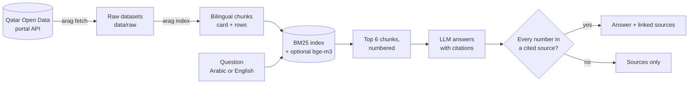

# Arabic RAG Assistant · مساعد الإحصاءات

[](https://github.com/A7mad8asim/arabic-rag-assistant/actions/workflows/tests.yml)

**Ask Qatar's official open statistics a question in Arabic or English, and get a short answer where every figure links to the dataset it came from.**

The corpus is the **1,432 datasets the National Planning Council publishes on the [Qatar Open Data portal](https://www.data.gov.qa)**: population, labour, health, energy, trade, transport and more, about 3.2 million rows in all.

The design rule: **the model may only repeat a number that appears in a source it cites.** If an answer contains any other number, it is not shown, and the reader gets the sources instead. If the sources don't contain the answer, the model must say so.

> Status: **work in progress.** The pipeline, tests, a 40-question seed gold set and a first baseline are in place; a larger benchmark and the app are next. See [Roadmap](#roadmap).

---

## How it works



| Step | What happens | Where |
| --- | --- | --- |
| Fetch | Downloads the catalog and each dataset's rows through the portal's Explore API v2.1, caching them locally. A second run only downloads what changed | `portal.py` |
| Chunk | One *card* per dataset (titles, descriptions, keywords and columns in both languages) plus *row* chunks grouped by year | `chunking.py` |
| Bilingual rows | The portal keeps Arabic values in twin columns (`municipality` = Doha, `lbldy` = الدوحة). Twins are paired by their normalized Arabic label and written together, `Doha / الدوحة`, so one chunk matches a question in either language | `chunking.py` |
| Retrieve | BM25 over normalized, lightly stemmed tokens (Arabic diacritics, hamza and taa marbuta variants, Arabic-Indic digits unified). Optional hybrid with bge-m3 embeddings via Ollama, fused by reciprocal rank fusion | `text.py`, `index.py` |
| Answer | A local **Qwen3-8B via Ollama** answers from the numbered sources only, in the question's language, citing `[n]`. Claude via the API is an optional comparison | `llm.py`, `pipeline.py` |
| Check | Every number in the answer must appear in a cited source (or the question). Otherwise the answer is withheld | `pipeline.py` |

## Quick start

Requires Python 3.11+ and [Ollama](https://ollama.com). Commands are for Windows PowerShell; on macOS/Linux activate with `source .venv/bin/activate`.

```powershell
python -m venv .venv
.venv\Scripts\activate
pip install -e ".[dev]"
ollama pull qwen3:8b

arag fetch            # downloads the 1,432 datasets (about 20 minutes the first time)
arag index            # builds the search index
arag ask "How many hotel gyms were there in Doha in 2023?"
arag ask "كم عدد المواليد الأحياء المسجلين في 2020؟"
arag search "electricity consumption residential"   # retrieval only, no model
```

Settings are listed in [`.env.example`](.env.example). `arag fetch --limit 50` downloads a small sample for a quick try.

## Evaluation

```powershell
arag eval --retrieval-only     # hit@1, hit@6 and MRR, no model needed
arag eval                      # also answers every question and scores the answers
```

- **Gold set ([`eval/gold.jsonl`](eval/gold.jsonl)):** a seed of 15 questions, each in English and Arabic (3 of the Arabic ones in Gulf dialect), plus 5 pairs that the data cannot answer (out of scope, or years with no data). Every gold value was checked against the downloaded rows.
- **Retrieval:** dataset-level hit@1, hit@6 and MRR. The question is "did a chunk from the right dataset come back?"
- **Answers:** a question counts as correct when the answer is grounded, contains the gold value and cites the gold dataset. An unanswerable question counts as correct when the system says it could not find the answer.

### Results

**First baseline: 75% of the 40 seed questions answered correctly on a local 8B model, with every shown figure traceable to a cited dataset.**

Measured on 7 October 2026: Qwen3-8B (4-bit) via Ollama on an RTX 5060 Ti 16 GB, BM25 retrieval, top 6 chunks, index of 23,465 chunks from 1,432 datasets. Raw results: [`eval/results/baseline.json`](eval/results/baseline.json).

| Metric | English | Arabic | Overall |
| --- | --- | --- | --- |
| Retrieval hit@1 (right dataset ranked first) | 67% | 60% | 63% |
| Retrieval hit@6 | 73% | **100%** | 87% |
| Retrieval MRR | 0.70 | 0.77 | 0.73 |
| Answer accuracy (30 lookups + 10 unanswerable) | 70% | **80%** | **75%** |
| Unanswerable questions refused | 80% | 100% | 90% |

What the errors show:

- **Gulf dialect:** all 3 dialect questions were answered correctly.
- **The grounding check worked as designed:** 3 answers contained a number that was not in their cited sources and were withheld.
- **Grounded but wrong:** 3 English answers quoted a real figure from the wrong row or table (for example Wifaq phone-call services instead of in-person services). The check stops invented numbers, not wrong picks; better retrieval and a reranker are the next steps.
- **Arabic retrieves better than English at depth 6,** because the Arabic text in each chunk (titles, column labels, values) is more specific than the often-generic English labels.
- The seed set is small (15 question pairs), so treat these numbers as a first smoke test, not a benchmark yet.

## Roadmap

- [ ] Grow the gold set to 100 questions (50 pairs) plus 20 unanswerable ones, with more Gulf dialect
- [ ] Ablation: BM25 → + bge-m3 hybrid → + query translation → + reranker, per language
- [ ] Streamlit app with cited sources and a screenshot
- [ ] Handle the 16 datasets with more than 5,000 rows (currently indexed by their description card only)
- [ ] Compare Qwen3-8B with the Claude API on the same set; Docker

## Data and licence

Data: National Planning Council, State of Qatar, via the [Qatar Open Data portal](https://www.data.gov.qa), licensed [CC BY 4.0](https://creativecommons.org/licenses/by/4.0/). The data is downloaded by `arag fetch` and is not stored in this repository. Answers are only as current as the last fetch; always check the linked dataset before relying on a figure.
